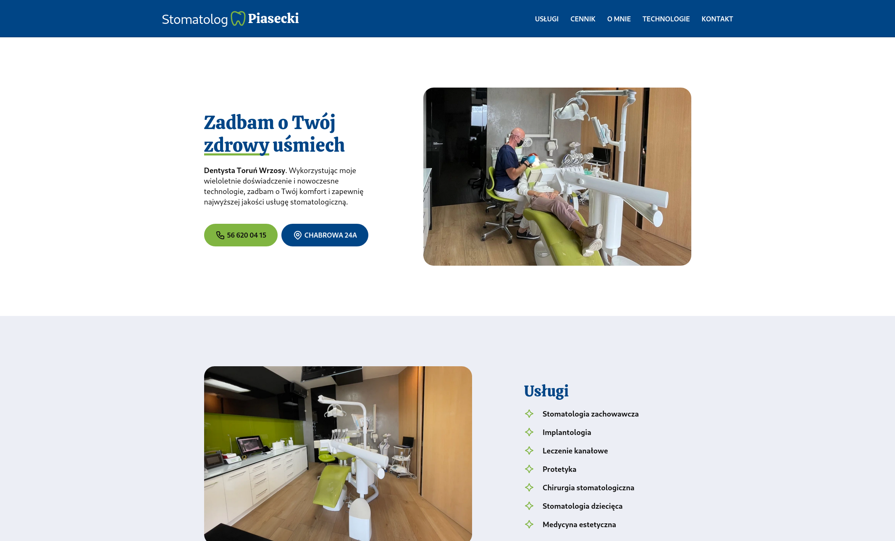
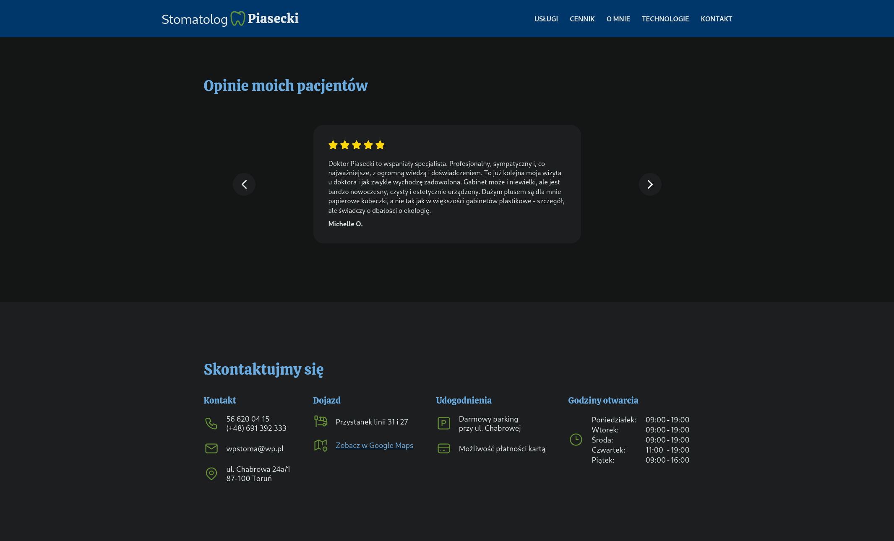

# Stomatolog Piasecki

## About

This project is a dental website made for one of my clients. Built using HTML, CSS, vanilla JS. Put together with Gulp.js.

It is only available in Polish 🇵🇱 language. Please just treat is as lorem ipsum. 😉

## Live Version

Available at: https://stomatologpiasecki.pl/

## Features

-   **Responsive Design**: Optimized for seamless use on both desktop and mobile devices.
-   **Light and Dark Modes**: Automatically adjusts to match the user's preferred theme.
-   **Modern Aesthetics**: Clean, professional design with consistent color schemes, fonts and style.
-   **User-Friendly Navigation**: Intuitive menus (navigation and mobile) for easy access to services, pricing, used technologies and contact information.
-   **Informative Content**: Detailed descriptions of services, technologies, and professional background.
-   **Patient Testimonials**: Interactive carousel with reviews from patients.

## Screenshots

## Run Locally

1. Clone the project to your local machine:

`git clone https://github.com/kaklewski/stomatolog-piasecki`

2. Navigate to the project directory:

`cd stomatolog-piasecki`

3. Install the dependencies:

`npm install`

4. Start the development environment:

`gulp`
